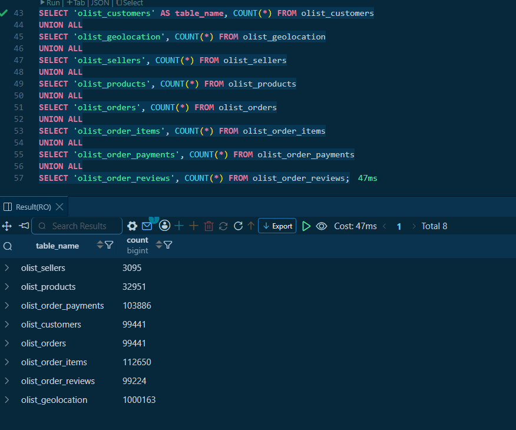
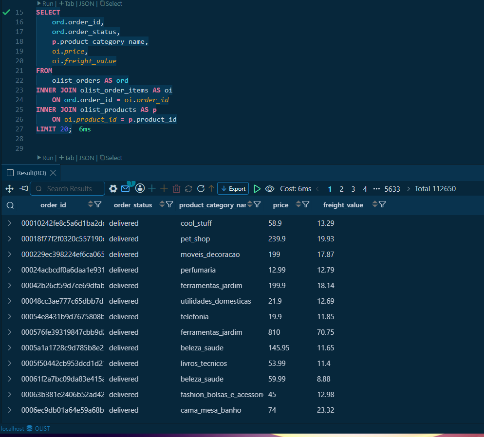
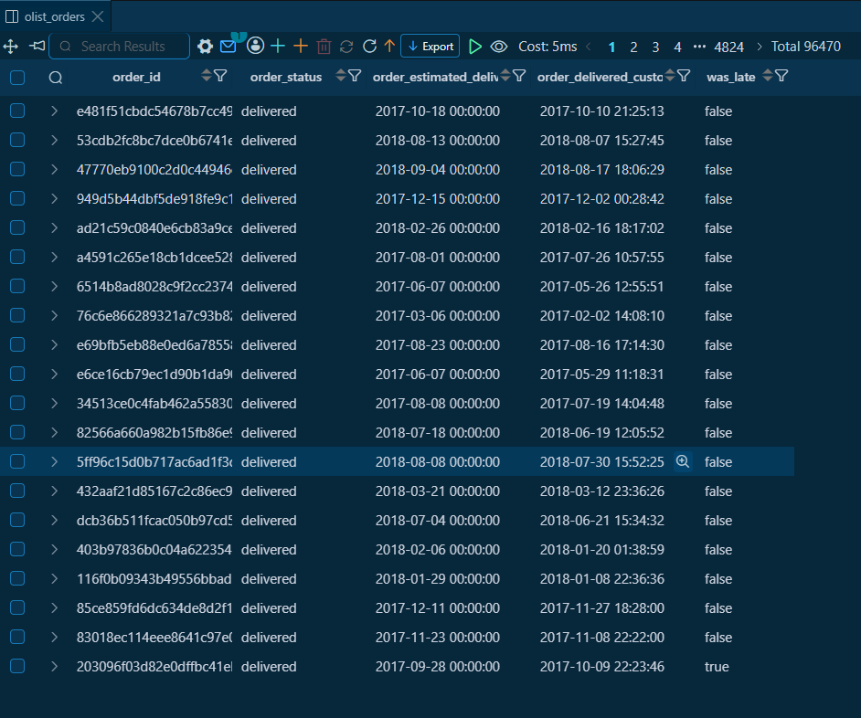

# Olist E-Commerce Database Setup

This repo contains the database setup for a project analyzing the [Olist Brazilian
E-Commerce dataset](https://www.kaggle.com/datasets/olistbr/brazilian-ecommerce),
with the eventual goal of predicting whether an order will be delivered late or on
time.

It includes a Docker Compose setup for PostgreSQL, SQL scripts to create the schema
with proper primary and foreign key relationships, and scripts to load the raw CSV
data (downloaded separately from Kaggle) into the database.

## Project structure

```
.
├── docker-compose.yml   # Postgres container definition
├── schema.sql             # CREATE TABLE statements for all 8 tables
├── test_queries.sql       # Queries used to verify the schema and joins
├── .gitignore
└── screenshots/           # Evidence the database works end-to-end
```

## Schema

The dataset is made up of 8 related tables, based on the entity relationship
diagram published with the dataset:

| Table | Primary key | Notes |
|---|---|---|
| `olist_customers` | `customer_id` | |
| `olist_geolocation` | *(none — reference table)* | Multiple rows share the same `zip_code_prefix` |
| `olist_sellers` | `seller_id` | |
| `olist_products` | `product_id` | |
| `olist_orders` | `order_id` | FK to `olist_customers` |
| `olist_order_items` | Composite: `(order_id, order_item_id)` | FKs to `olist_orders`, `olist_products`, `olist_sellers` |
| `olist_order_payments` | Composite: `(order_id, payment_sequential)` | FK to `olist_orders`; an order can have multiple payments |
| `olist_order_reviews` | Composite: `(review_id, order_id)` | FK to `olist_orders`; `review_id` alone is not unique in the source data |

`orders` is the central table — most other tables (`order_items`, `payments`,
`reviews`) reference it via `order_id`, so it must be created and loaded before
those tables.

## Setup

1. **Start the database**
   ```
   docker compose up -d
   ```
   This starts a Postgres container with a persistent volume, so data survives
   container restarts.

2. **Create the schema**
   Run `schema.sql` against the database to create all 8 tables in the correct
   dependency order.

3. **Download the data**
   Download the CSV files from the [Kaggle dataset page](https://www.kaggle.com/datasets/olistbr/brazilian-ecommerce)
   (not included in this repo — see `.gitignore`).

4. **Load the data**
   Load each CSV into its corresponding table using Postgres's `COPY` command
   (run from inside the container after copying the CSVs in with `docker cp`).

5. **Verify**
   `test_queries.sql` contains a set of queries used to sanity-check the load and
   the table relationships (row counts, and joins across the FK relationships).

## Verification

**Row counts across all 8 tables**, confirming the full dataset loaded correctly:



**Three-table join** (`orders` → `order_items` → `products`), confirming the
foreign key relationships work correctly across multiple tables:



**A first look at the actual problem being solved** — computing whether each
delivered order arrived after its estimated delivery date:



## Challenges & what I learned

This was my first time working with Docker, so a lot of this project was as much
about learning the tooling as it was about the database itself.

- **Started with a full VM before realizing it wasn't necessary.** I initially ran
  Docker inside VirtualBox to get Linux practice, before learning that Docker
  Desktop on Windows already runs through WSL2 and doesn't need a separate VM for
  this kind of setup. I switched to Docker Desktop directly for the actual
  project.
- **Docker Compose and YAML syntax took a few tries to get right.** Early attempts
  mixed `docker run` flags directly into the YAML file, used the wrong list
  syntax, and had inconsistent indentation. Comparing each `docker run` flag
  (`-p`, `-e`, `-v`) to its YAML equivalent (`ports:`, `environment:`,
  `volumes:`) is what made it click.
- **Data didn't persist across restarts at first.** The first container was run
  without a volume, so the database reset every time the PC restarted. Fixed by
  adding a named volume (`postgres_data:/var/lib/postgresql/data`) and a
  `restart: unless-stopped` policy in the compose file.
- **Loading CSVs from Windows into a containerized database isn't
  straightforward.** Postgres's `COPY` command reads files from *inside* the
  container, not the host machine, so a Windows file path doesn't work directly.
  I used `docker cp` to copy each CSV into the container's `/tmp` folder first,
  then ran `COPY` from a `psql` session inside the container itself.
- **Designing composite primary keys required actually reasoning about the
  data**, not just copying a pattern. For `olist_order_items` and
  `olist_order_payments`, a single column (`order_id`) wasn't unique on its own,
  since one order can have multiple items or multiple payments — the fix was a
  composite key combining `order_id` with a per-order sequence column.
- **The CSV load surfaced a real data quality issue**: `olist_order_reviews_dataset.csv`
  has duplicate `review_id` values attached to different `order_id`s. My original
  single-column primary key (`review_id`) rejected the load. Investigating the
  duplicates (same `review_id`, different `order_id`) confirmed this wasn't
  accidental — the table was rebuilt with a composite key on `(review_id,
  order_id)` to keep all the real rows instead of discarding data.

## Notes

- `olist_order_reviews_dataset.csv` contains duplicate `review_id` values attached
  to different `order_id`s. This is a known quirk of the source data, not a
  loading error — the table uses a composite primary key on
  `(review_id, order_id)` to preserve all rows instead of dropping data.
- No EDA has been performed at this stage — that's a separate, later task. This
  repo only covers getting the raw data into a working, queryable relational
  database.
